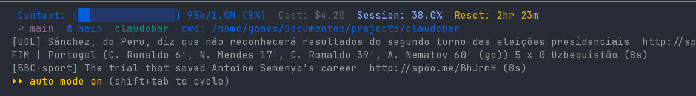

<div align="center">

# 🛰️ claudebar

**A multi-line, time-aware status bar for [Claude Code](https://claude.com/claude-code).**

Compose widgets — news headlines, football scores, the live World Cup scoreboard —
into the status line at the bottom of your terminal, and swap what's shown by time of day.



</div>

---

claudebar plugs into Claude Code's `statusLine` hook, so it shows up automatically while you work. Each line **cycles** through its items every few seconds. Already using a status line tool like `ccstatusline`? claudebar keeps it running as one of its lines.

```text
[UOL] Sánchez, do Peru, diz que não reconhecerá resultados do segundo turno…  http://spoo.me/…  (8s)
FT | Portugal (C. Ronaldo 6', N. Mendes 17', C. Ronaldo 39', A. Nematov 60' (gc)) 5 x 0 Uzbekistan  (8s)
[BBC-sport] The trial that saved Antoine Semenyo's career  http://spoo.me/BhJrmH  (8s)
```

## ✨ Features

- **🧩 Widgets** — news, football news, and a live FIFA World Cup scoreboard (with scorers next to each team).
- **🪄 Wraps your existing status line** — keep `ccstatusline` or any custom command as one line.
- **🕑 Time-based schedules** — different lines during work hours vs. evening, wrapping past midnight.
- **🌍 Bilingual** — English and Portuguese (BR).
- **⚡ Cached & fast** — network data is cached with short TTLs so the bar stays snappy.

## 📋 Requirements

- **Node.js 18+** (developed on Node 22)
- **Claude Code** installed, with a `~/.claude/settings.json` (created the first time you run Claude Code)

## 📦 Install

claudebar isn't on npm yet. The simplest way is to install it straight from GitHub (you need access to the repo) — it builds itself on install:

```bash
npm install -g github:gomeslucasm/claudebar
```

That puts the `claudebar` command on your `PATH`. Run the same command again to update.

<details>
<summary>Install from a local clone instead</summary>

```bash
git clone https://github.com/gomeslucasm/claudebar.git
cd claudebar
npm install      # runs the build automatically (prepare script)
npm link         # makes the `claudebar` command available globally
```

If you'd rather not link, call `node /path/to/claudebar/dist/cli/index.js` directly.
</details>

## 🚀 Quick start

```bash
claudebar init
```

The interactive setup walks you through:

1. **Language** — English or Portuguese (BR).
2. **Lines** — how many status-bar lines you want, and what goes in each.
3. **Schedules** *(optional)* — time windows where specific lines change.
4. **Hook up Claude Code** — it offers to write the `statusLine` entry into `~/.claude/settings.json` for you. Say yes and you're done.

Restart Claude Code and the bar appears. If claudebar detects an existing status line tool, it offers to keep it as one of the lines so you don't lose what you had.

## 🧩 Widgets

Each line is one or more widgets that **rotate** — every few seconds the line advances to the next item.

| Widget | What it shows |
|---|---|
| **`worldcup`** | Live FIFA World Cup scoreboard — live / finished / upcoming matches, with scorers next to each team (`Portugal (Ronaldo 6') 1 x 0 Uzbekistan`). Data from ESPN. |
| **`news`** | RSS headlines. Built-in: `G1`, `Folha`, `UOL`, `HN`, `TechCrunch`, `Ars`, `Verge`. |
| **`soccer`** | Football news. Built-in: `GloboEsporte`, `ESPN-soccer`, `BBC-sport`, `UOL-esporte`. |
| **`passthrough`** | Runs any command and shows its output verbatim — use it to wrap `ccstatusline` or your own script. Always solo (can't share a line). |

Content widgets (`news`, `soccer`, `worldcup`) can be combined on one line and rotate together. `passthrough` always takes a line to itself. You pick the **seconds per item** per widget during setup (5–30s).

## 🕑 Schedules

A schedule is a time window (e.g. `18:00 → 23:00`) where some lines differ from the default. Only the lines you change are overridden — everything else stays put. Windows that wrap past midnight (e.g. `23:00 → 06:00`) work as expected.

> Example: keep your normal status line during work hours, then switch line 2 to the World Cup scoreboard in the evening.

## ⚙️ Configuration

Config lives at `~/.claudebar/config.json`. Re-run `claudebar init` to rebuild it interactively, or edit the JSON directly:

```jsonc
{
  "lang": "en",
  "default": {
    "lines": [
      [{ "widget": "passthrough", "command": "npx -y ccstatusline@latest" }],
      [{ "widget": "news", "sources": ["HN", "TechCrunch"], "interval": 10 }],
      [{ "widget": "worldcup", "interval": 8 }]
    ]
  },
  "schedules": [
    {
      "name": "evening",
      "from": "18:00",
      "to": "23:00",
      "overrides": {
        "1": [{ "widget": "soccer", "sources": ["GloboEsporte"], "interval": 10 }]
      }
    }
  ]
}
```

- **`lines`** — an array of lines; each line is an array of widgets.
- **`overrides`** — keyed by line index (as a string), sparse: only the lines that change.
- **`interval`** — seconds each item stays before the line rotates.

Cached network data is stored under `~/.claudebar/cache/` with short TTLs.

## 🖥️ Commands

| Command | Description |
|---|---|
| `claudebar init` | Interactive setup. |
| `claudebar run` | Render the lines once — this is what Claude Code calls on each refresh. |

## 🔌 How it connects to Claude Code

`claudebar init` adds this to `~/.claude/settings.json`:

```json
{
  "statusLine": {
    "type": "command",
    "command": "claudebar run",
    "padding": 0,
    "refreshInterval": 1000
  }
}
```

Claude Code calls `claudebar run` on each refresh and renders whatever it prints. To remove claudebar, delete that `statusLine` block (or point it back at your previous tool).

## 🛠️ Development

See **[DEVELOPMENT.md](./DEVELOPMENT.md)** for building from source, project layout, and how to add a widget.

## 📄 License

[MIT](./LICENSE)
